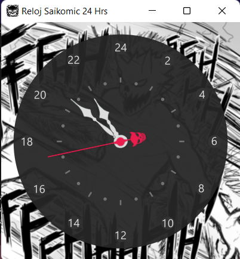

# Acerca de

Reloj en formato analógico propuesto por el mangaka chileno Saikomic. Las horas se leen en modulo 24 en lugar de 12, los minutos y segundos se leen como un reloj común y corriente.
Este programa está escrito en Java, hecho en [Processing](https://processing.org/), usando como referencia este [ejemplo de reloj](https://processing.org/examples/clock.html).  



---

# Diferencias con respecto a un reloj convencional

**Ventajas:**

- Tiene 24 horas y el día dura 24 horas ノಠ_ಠノ
- Es canon en [**Antagonista**](https://medibang.com/mpc/titles/6k2208160633320990004683825/)
- Literalmente NINGUNA otra ventaja

**Desventajas:**

- El minutero avanza una cantidad no entera de minutos (2.5) por cada división de hora
- El segundero no coincide con divisiones de hora impares
- Los términos AM y PM quedan inutilizados
- Se roba el dinero de tu almuerzo

---

# Notas

- Incluye un ejecutable compatible con Windows de modo que NO requiere instalar processing para compilar el programa pero es muy probable que necesites instalar una versión de Java.
- Acá hay una versión que incluye la librería de Java y que no requiere instalar nada: [RELOJ (120MB)](https://drive.proton.me/urls/RTTH98XVPG#2STgi4AxlwyE)
- Es posible editar cada una de las imagenes utilizadas: imagen de fondo, circulo con los números, horario, minutero y segundero. Disponibles en la carpeta ```...\data\```
- Para poder modificar el reloj solo es necesario descargar Processing y editar el código del archivo ".pde". 
- Ilustraciones y conceptos incluidos en las imagenes "bg.png", "icon.png" y "mseg.png" son propiedad intelectual de Saikomic.